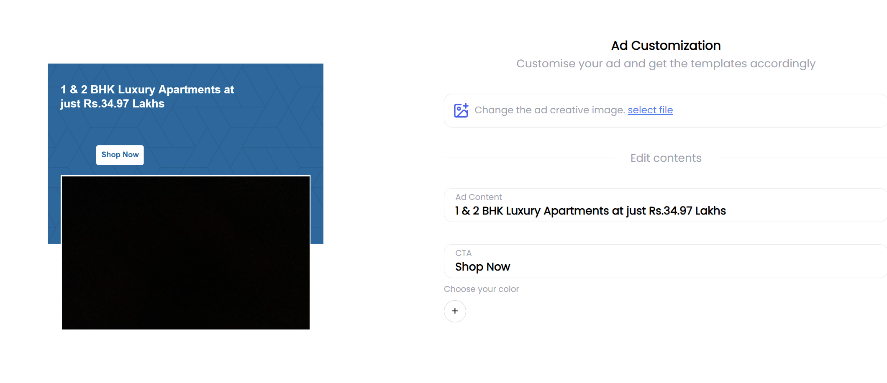
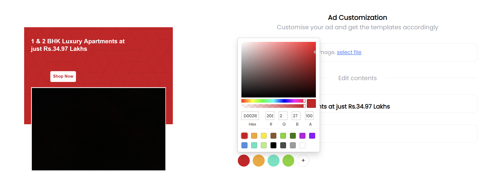
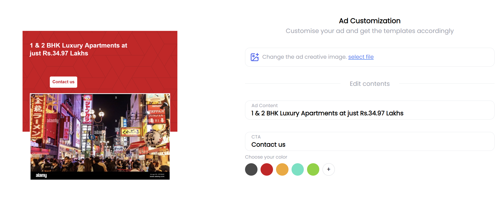

# Canvas Editor

Welcome to the Canvas Editor project! This project is a simple, interactive canvas editor built with vanilla HTML Canvas, React (functional components), and Tailwind CSS. Users can select an image to be placed within a mask on the canvas, change the caption text and call-to-action (CTA) with text inputs, and customize the background color of the template. The project leverages OOP principles and does not use any libraries like fabric.js for canvas manipulation.

<h2>Project Screenshots:</h2>







## Table of Contents

- [Features](#features)
- [Technologies Used](#technologies-used)
- [Setup and Installation](#setup-and-installation)
- [Usage](#usage)
- [Template Data](#template-data)
- [File Structure](#file-structure)
- [Contributing](#contributing)
- [License](#license)

## Features

- **Interactive Canvas Editor**: Users can interact with the canvas to add and edit text, images, and background color.
- **Caption and CTA Text Editing**: Users can change the caption and CTA text, position, font size, alignment, and color.
- **Image Masking**: Users can select an image to be placed within a predefined mask area.
- **Customizable Background**: Users can change the background color of the template.
- **Persisted Colors**: The last 5 picked colors are shown for easy re-selection.

## Technologies Used

- **React**: For building the user interface.
- **Tailwind CSS**: For styling the application.
- **HTML Canvas**: For drawing and manipulating the canvas elements.

## Setup and Installation

1. **Clone the Repository:**
   ```bash
   git clone https://github.com/yourusername/canvas-editor.git
   cd canvas-editor
2. **Install Dependencies:**
   ```bash
   npm install
3. **Run the Application:**
   ```bash
   npm start
4. **Open in Browser:**
  Open your browser and navigate to http://localhost:3000
## Usage

- **Upload Image:** Click on the image upload button to select an image for the canvas.

- **Edit Caption:** Use the text input to change the caption text. Adjust its position, font size, alignment, and color as needed.

- **Edit CTA:** Similarly, use the text input to change the CTA text. Customize its position, font size, alignment, and color.

- **Change Background Color:** Select a color from the color picker to change the canvas background.